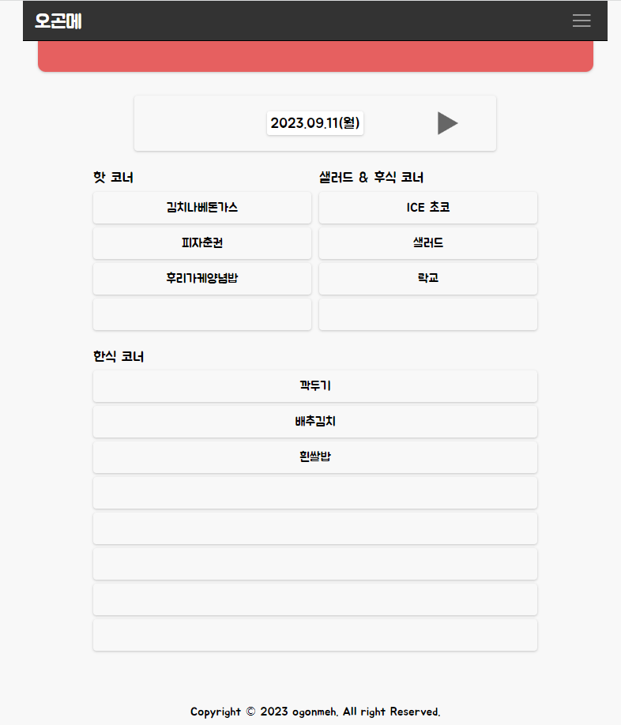
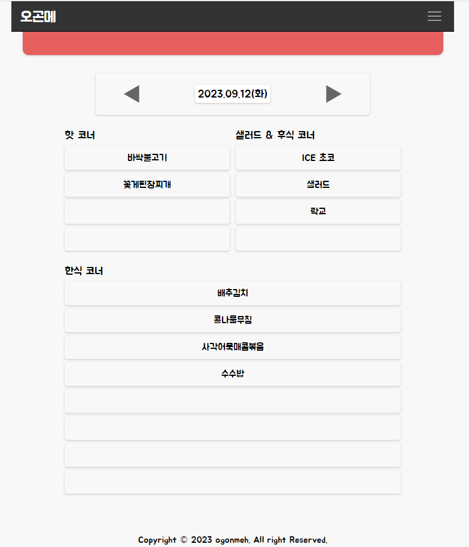
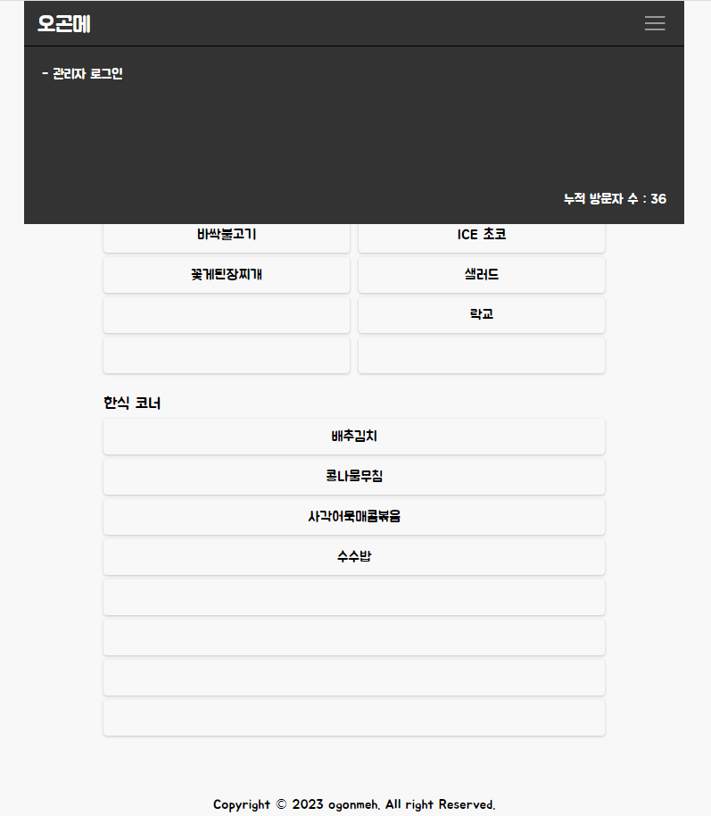
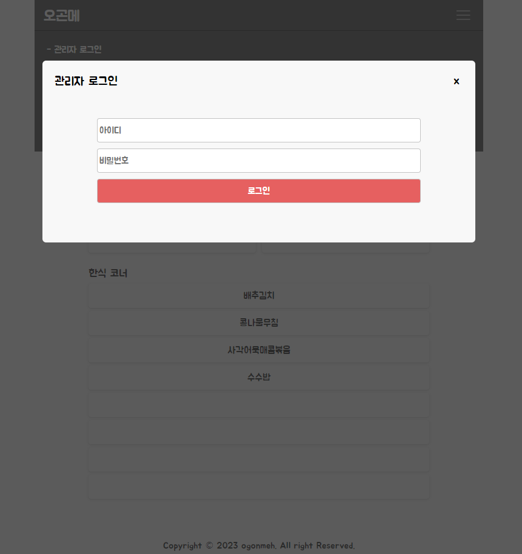
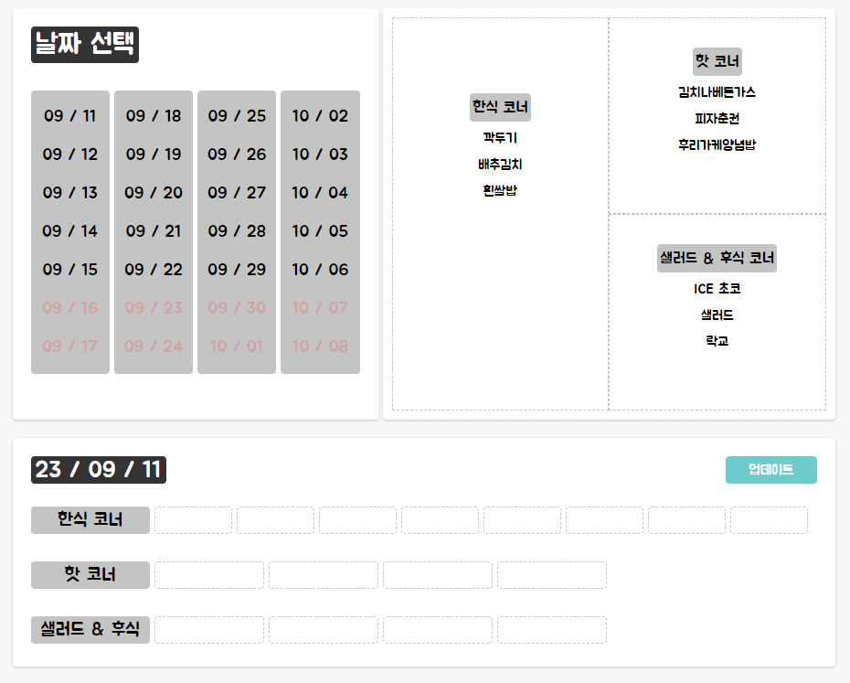
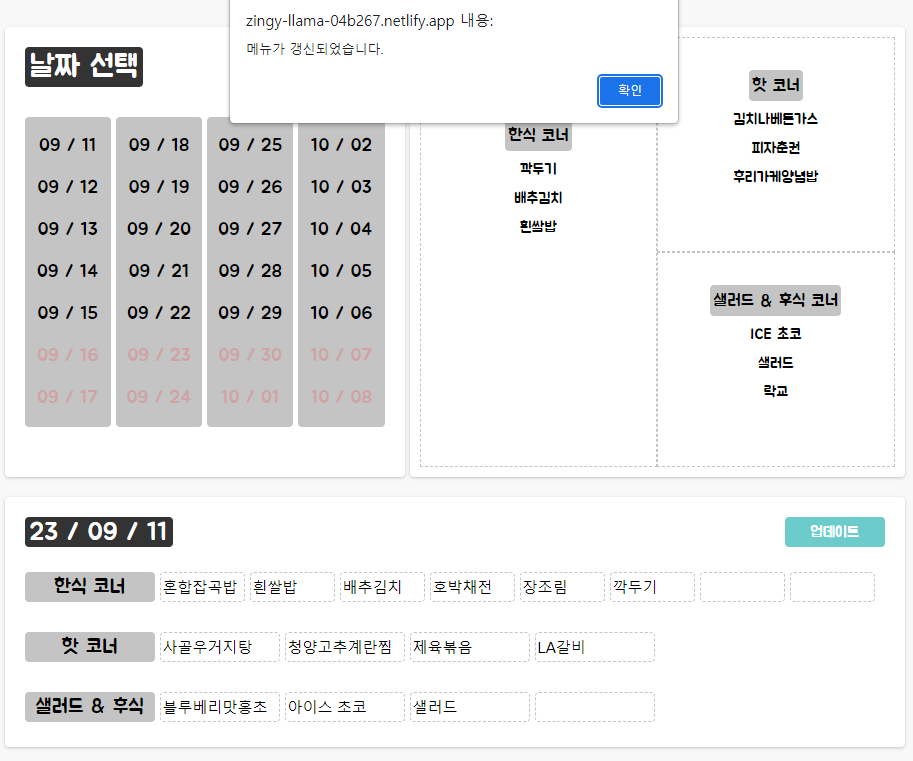
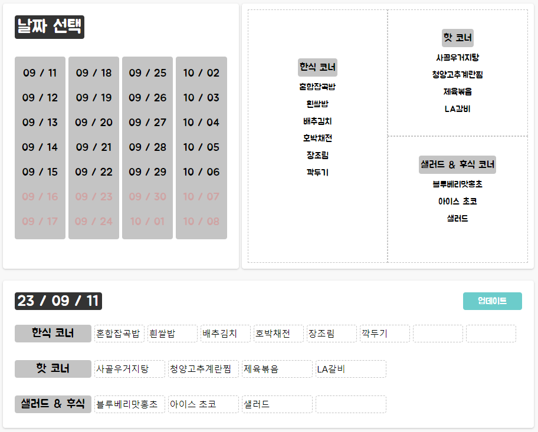

# 🙌 ogonmeh
   

## ❓ ogonmeh가 뭐예요?   
- **서강대학교에 위치한 곤자가 뷔페의 메뉴를 확인하기 위한 서비스입니다.**
- 서강대학교 학생과 신촌 내 거주자 및 직장인을 대상으로 개발하였습니다.

## 🙋‍♀️ 유입경로는 어떻게 되나요?
- 현재 학생들이 가장 많이 모여있고, 정기적으로 뷔페 메뉴를 묻는 공간인 서담 커뮤니티에 배너를 생성해서 오곤메 서비스를 링크하려고 합니다.
- 곤자가 컨벤션 홈페이지에도 배너 생성을 목표로 하고 있습니다.

## 😀 팀원 소개 및 역할 분담
**임준석**
- 기획 및 아이디어 제공 담당
- 곤자가 컨벤션, 서담 커뮤니티 운영자와 컨택 담당
- 디자인 시안 작업 담당

**장수민**
- Front-end, Back-end 구현 담당

| 장수민 |
| --- |
| [   @jangsumin](https://github.com/jangsumin) |

## 🛠 문제 인식   
- 뷔페 이용자들이 뷔페를 직접 방문하지 않고서는 메뉴를 알 수 없어서 불편했습니다.

## 🛠 요구사항 정의
- 로그인을 하지 않고도, 메뉴를 한 눈에 알아볼 수 있는 모바일 기반의 메인 웹 페이지가 필요합니다.
- 관리자는 로그인을 통해 관리자 페이지로 접속하고, 메뉴를 생성(Create), 조회(Retrieve), 수정(Update), 삭제(Delete) 할 수 있어야 합니다.

## 👉 개발 환경 및 배포 URL
**개발 환경**
- Front-end : *TypeScript*
- Back-end : *Node.js*, *Express.js*
- Database : *MongoDB*
- Front-end 배포 : *Netlify*
- Back-end 배포 : *cloudtype.io*

**배포 URL**
- [ogonmeh 페이지](https://zingy-llama-04b267.netlify.app/)
   
## 👉 개발 기간 및 작업 관리
- 23.05.09 ~ 23.07.03 : 기획, 디자인, 개발
- 23.07.04 ~ 23.07.16 : 배포
- 23.07.17 ~ current : 리팩토링

## 📄 프로젝트 구조
[ogonmeh-front](https://github.com/jangsumin/ogonmeh-front)
- `index.html` : 메인 페이지 구조
- `manager.html` : 관리자 페이지 구조
- `dist` : 타입스크립트을 컴파일한 자바스크립트 파일
- `src/app.ts` : 메인 페이지 타입스크립트 소스 파일
- `src/manager.ts` : 관리자 페이지 타입스크립트 소스 파일
- `src/assets/images/` : 이미지 폴더
- `src/assets/styles/` : 스타일시트 폴더

[ogonmeh-back](https://github.com/jangsumin/ogonmeh-back)   
- `app.js` : 서버의 진입점
- `src/db` : 객체 문서 매퍼 mongoose를 Node.js에 연결
- `src/controllers` : 사용자와 관리자가 사용하는 API를 개별 제어
- `src/models` : Menu 스키마와 Visitor(방문자) 스키마 정의
- `src/routes` : 라우터 생성 및 app.js과 연동

## 📄 페이지 기능
**1. 메인 페이지**
| 메뉴 확인 | 날짜 변경 |
| --- | --- |
|  |  | 

| 방문자 수 확인 | 로그인 창 |
| --- | --- |
|  |  |

- 메뉴는 오늘을 기준으로 4주간 주말을 제외하고 확인할 수 있습니다.
- 햄버거 버튼을 클릭하면, 관리자 로그인에 접근이 가능하고, 전체 누적 방문자 수를 확인할 수 있습니다.
- PC와 모바일에서 유사한 UI로 메뉴를 확인할 수 있습니다.

**2. 관리자 페이지**
| 메뉴 입력 및 확인 | 메뉴 수정 |
| --- | --- |
|  |  |

|메뉴 수정 후 화면|
| --- |
|  |

- 메뉴는 오늘을 기준으로 4주간 주말을 제외하고 메뉴를 생성, 수정할 수 있습니다.
- PC에서 웹 페이지를 원활히 사용할 수 있습니다.

## 🚧 트러블 슈팅 및 개발 일지

### Front-end
[커밋 단위 개발 일지 - Front-end](https://jasminnnnn726.notion.site/Front-end-a60665946544477085c66ee617aa711e?pvs=4)   

### Back-end
[커밋 단위 개발 일지 - Back-end](https://jasminnnnn726.notion.site/Back-end-19804df530f94476a5f11146c4fe6c98?pvs=4)
